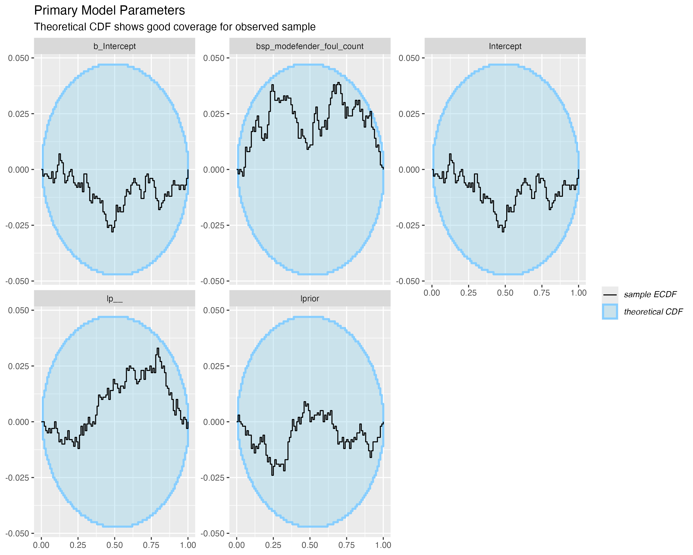
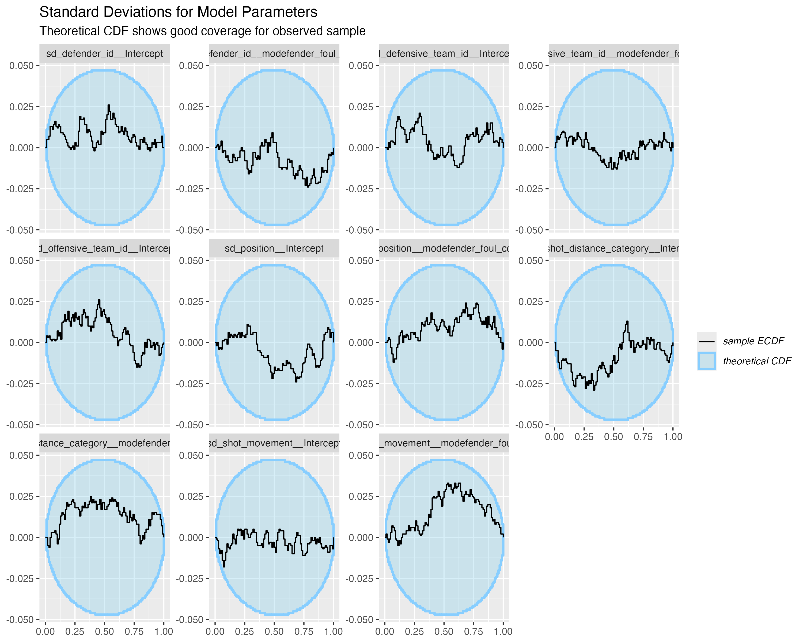
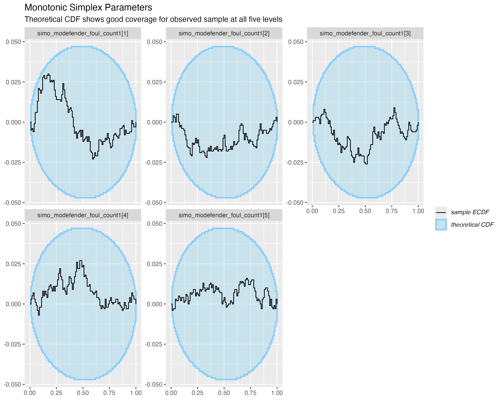
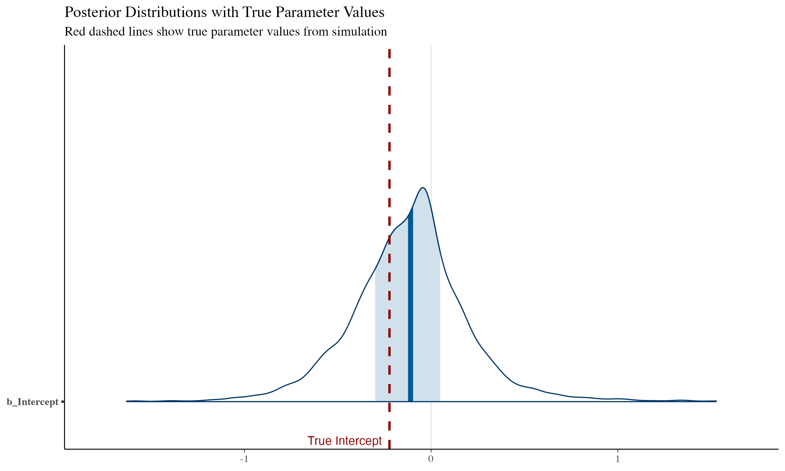
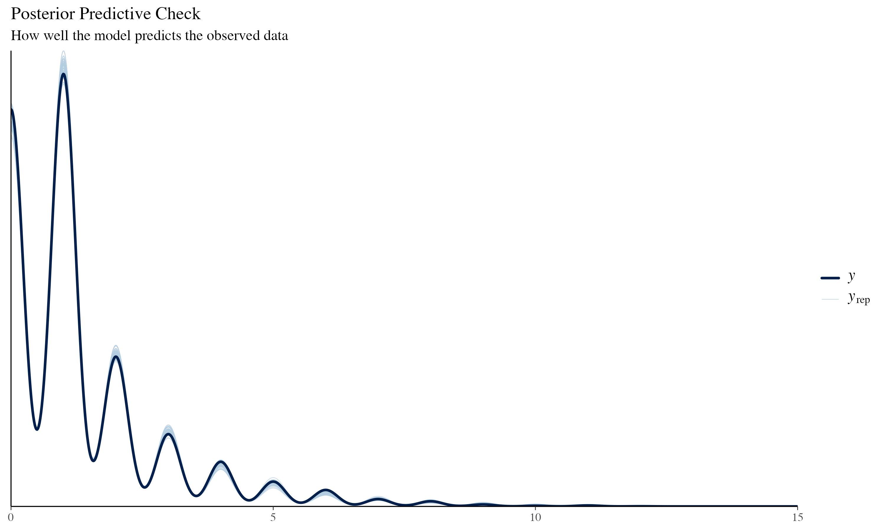
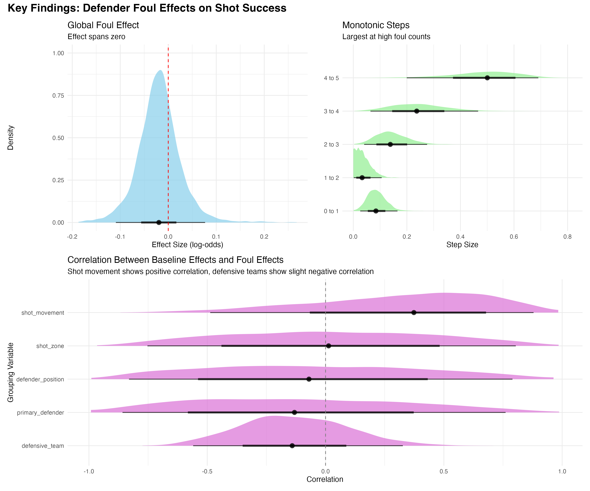
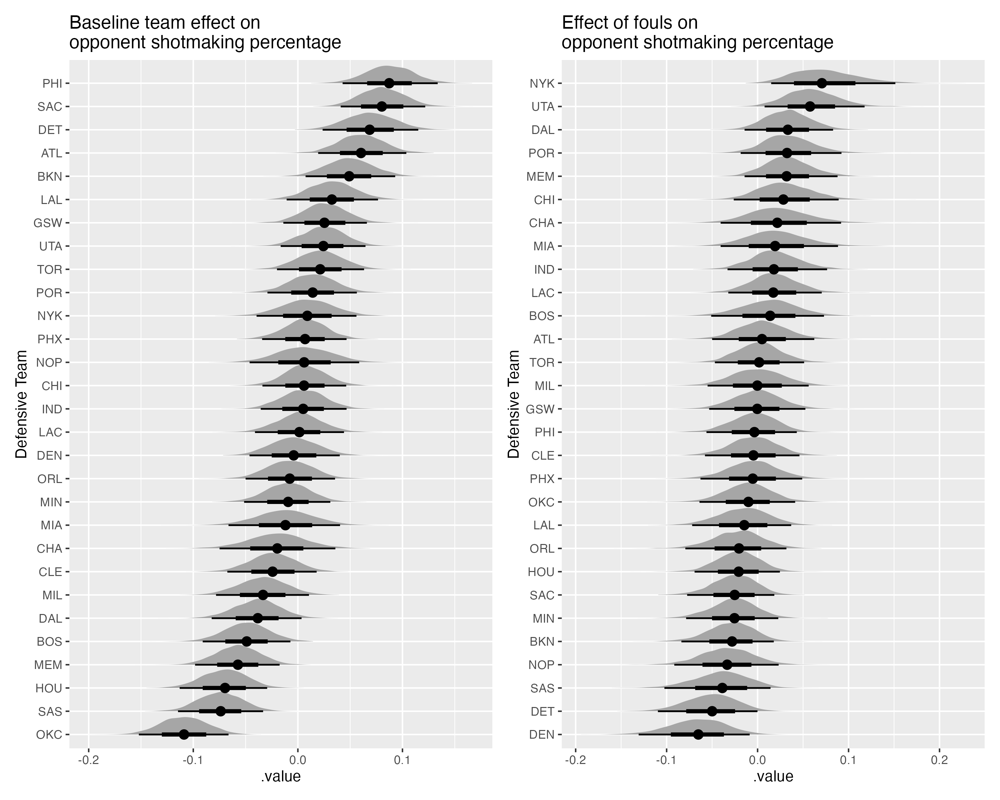
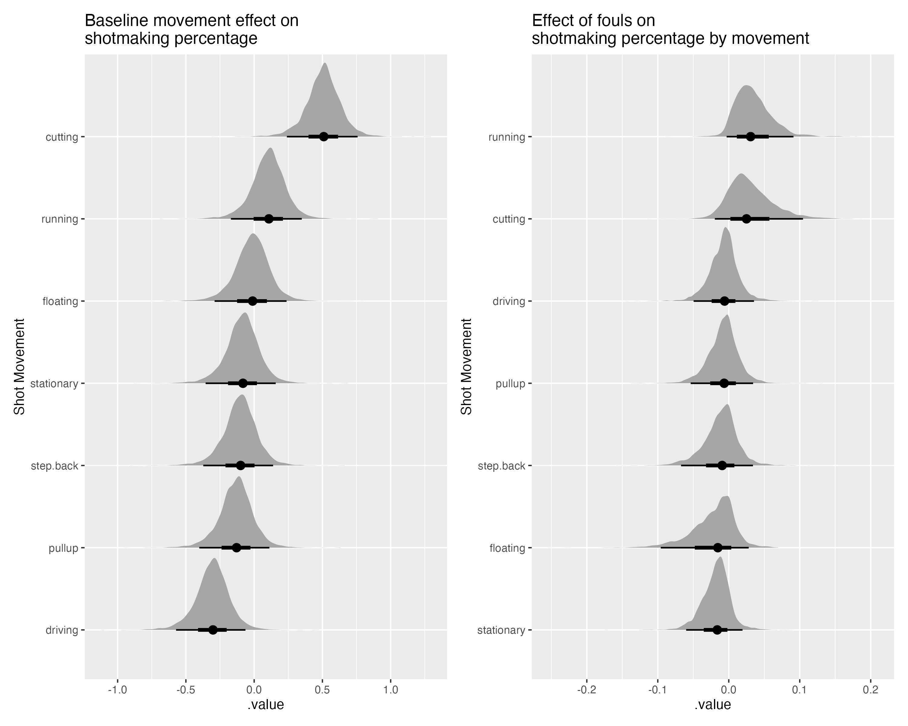
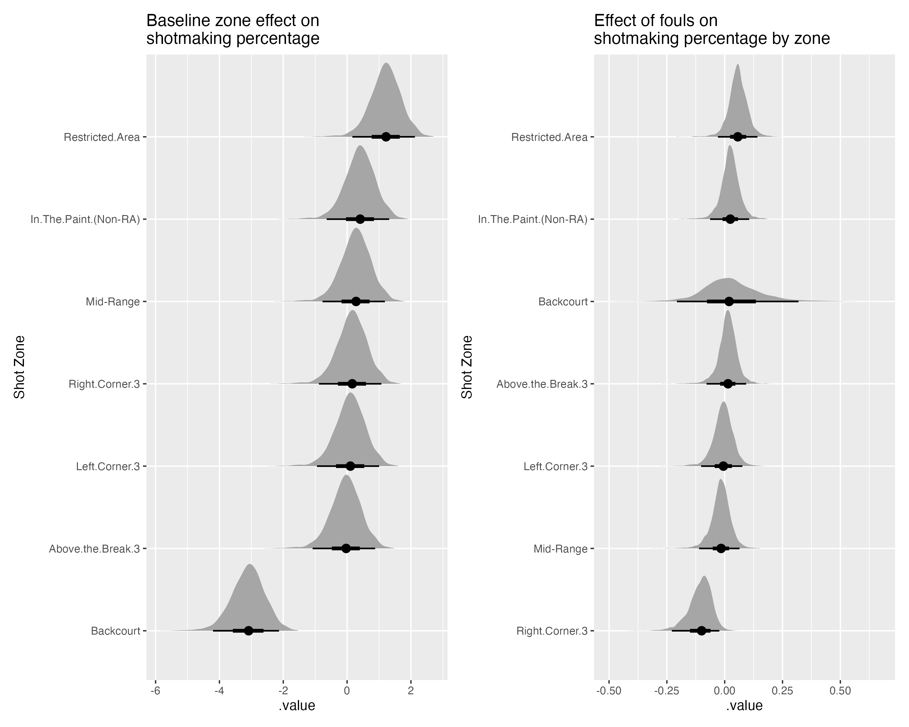

# Project Motivation

## Background on the Role of Physicality in NBA Games

Basketball is fundamentally a simple game: put a ball through a hoop. It's also a numbers game: put a ball through a hoop more times than your opponent. As a result, basketball analysis has historically focused on offensive aspects-who scored the most points, how they scored them, who assisted them, and so on. This offensive focus is natural given that the final score directly reflects which team scored more points.

The introduction of player tracking technology in the early 2010s briefly revolutionized defensive analysis by providing detailed data on defender positioning and movement. However, since 2016, this valuable player tracking data has been made private, creating a significant challenge for researchers outside NBA organizations.

This data limitation has created a critical gap in basketball analytics. Without access to detailed player tracking data, researchers are left with the same fundamental problem they faced before the tracking era: how can we effectively study and evaluate individual defensive ability when publicly available, "counting" statistics are either:

-   Primarily focused on offense

-   Only loosely related to defense (e.g., blocks and steals)

Solving this problem helps democratize defensive evaluation by creating metrics that can be derived from publicly available, play-by-play data. This would allow analysts outside NBA organizations to contribute meaningful insights to the game and help properly communicate the value of defensive players who may not show up in traditional box scores. Further, reliance on player tracking rather than play-by-play data relegates sample selection to a third-party data provider like [Synergy](https://sportradar.com/synergy-player-tracking/), whose publication aims may introduce bias by selecting observations which may not be representative of the game as a whole. As such, determining the viability of using counting stats to infer complex characteristics of games has the potential to reduce systematic uncertainty and risk of future policy changes by third parties.

At a broader level, developing robust defensive metrics from public data could help bridge the growing divide between basketball analytics and fan understanding. Currently, there exists a significant gap between analysts who rely on advanced metrics and fans who primarily use traditional counting stats like points, rebounds, and assists. Developing novel, simple, and intuitive ways of understanding the impact of difficult-to-measure latent player characteristics like defensive skill represents a crucial challenge in modern basketball analysis.

This project leverages personal fouls as a proxy for defensive ability in the NBA. Since players who accumulate 6 fouls are ejected from games, they must strategically adjust their defensive intensity based on foul count. This creates a natural experiment where we can observe how defensive behavior changes under varying foul pressure, potentially revealing defensive skill without requiring proprietary tracking data.

This project developed a novel set of testable assumptions that use players' tendencies to accumulate personal fouls throughout games as a measure of their latent defensive ability. By studying the way different players and their opponents' shotmaking tendencies are affected by the accumulation of fouls, we may be able to infer defensive impact without requiring proprietary tracking data. Because players 'foul out' of games when they reach 6 fouls, we assume they strategically modulate their defensive intensity to avoid ejection while still contributing defensively. This creates a natural experiment where we can observe how defensive and offensive behavior changes under varying levels of foul pressure, both at the individual and team level. We hypothesize that better defenders demonstrate distinct patterns in how they and their teammates respond to foul accumulation compared to weaker defenders, providing a measurable signal of defensive skill that can be extracted from publicly available data.

## Purpose

The purpose of this research is to estimate the causal influence of individual defender foul counts on the shotmaking probability of opposing offenses under the hypothesis that players' defensive skill is a latent trait that can be estimated using NBA play-by-play data.

## Confounding Expected

Among the challenges associated with quantifying any aspect of player skill—offensive, defensive, or otherwise—is separating individual from team contribution. We expect any analysis or model to be imprecise to some degree, and in this research attempt to account for unobserved confounds associated with shotmaking probability. These include offensive characteristics including offensive team, shot location, and shot type.

We narrow our study of defensive skill to offensive possessions that result in a shot. This means that we define defensive skill primarily as a component of any defending player's ability to affect the probability that any opposing offensive player successfully makes an attempted shot. We do not consider cases where an offensive possession results in a turnover, such as those caused by steals or shot clock violations, which although may be indicative of good or bad defense being played are ignored for the purpose of this analysis.

As such, any estimate of defensive skill should be interpreted as an estimate of defensive skill in the context of shotmaking, and should be assumed independent of higher-level, latent traits like general defensive skill, general skill, offensive skill, etc.

## Data

### Missingness

The dataset used for this paper include complete play-by-play records for every game played during the 2024-2025 NBA season. As our analysis relies on player-level position data reported on official NBA team rosters as of 2025-04-14, players who were included in games earlier in the season but were no longer part of any NBA rosters at the time of data access lacked position data and were dropped from the sample.

### Other Assumptions

A major assumption that justifies our use of play-by-play data for inference is that it represents a sample drawn from competitive basketball scenarios. We know, however, that this assumption does not hold under certain conditions, most notably when the score difference between opponents becomes large enough late in a game that coaches pull their competitive players in favor of substitutes, effectively ending competitive play. At this point during a game, we've entered Garbage Time. We assume the data generating process for observations in garbage time to be different from the process that creates observations of competitive play, and although we could model these separate processes, for simplicity's sake elect to exclude garbage time from our sample. Briefly, garbage time is defined as any time when the score difference between opponents is greater than 10 points and there are 2 or fewer starters on the floor between both teams. A complete definition of garbage time can be found in the supplemental code (here::here("00_R", "update-pbp.R")).

## Measurement

The target of inference (defensive skill) cannot be directly measured, and the primary measurement (foul count) is measured with some amount of error resulting from erroneous transcription in raw play_by_play data. Steps taken to account for transcription error can be found in the supplemental code.

Since foul counts differ between individual defenders, and defenders tend to play for fewer minutes as their foul count increases (Chu and Swartz, 2020), the sample size of shots taken in the presence of a defender with a high foul count versus a low foul count is unbalanced. Multilevel models and adaptive regularizing priors (McElreath, 2020, pp. 408) are used to mitigate over fitting such that comparisons can be made across foul counts.

# Literature Review

Bayesian models have been used in a number of previous studies to model the both offensive and defensive performance. Williams et al. (2024) used a Bayesian hierarchical modeling framework to model offensive performance of teams and players based on their shooting propensities and abilities. They used discretized shot loactions for the top 100 shot-takers from the 2008/2009–2020/2021 seasons to create an expected points above average (EPAA) metric. Our project differs in our use of hierarchical modeling to infer defensive impact, rather than contributing to the existing research on offense.

Franks et al. (2015) was one of the pioneering papers in using Bayesian hierarchical models to study player tracking data by modeling the relationship between a defensive assignment and the spatiotemporal shotmaking tendencies of various offensive players, which is to say how well they shoot the ball given the location, time, and defender of a shot attempt. Our project differs in that we use a Bayesian hierarchical model to infer defensive impact without using raw player tracking data, rather than modeling the relationship between a known defensive assignment and shotmaking tendencies.

Finally, Chu and Swartz (2020) use Bayesian methods to model the time-to-event of a foul as a gamma distributed function of a player, their accumulated number of fouls, and their position. Their goal was to develop a decision-making framework for coaches to use in determining when to sit players at risk of fouling out (usually when a player reaches 6 fouls) of a game. Although similar in spirit, our project doesn't model the time-to-event of a foul nor attempt to help coaches make decisions about sitting their players, but instead focuses on the effect of fouls while players are on the court.

# Modeling Strategy

This section details the steps taken to develop a novel model for inferring player defensive skill based on the Bayesian workflow proposed by Gelman and Hill (2006) and others. Naming conventions and statistical notation are in line with those used by McElreath. Our model can be broken down into the following component parts:

-   a narrative model of the system of inquiry,

-   a heuristic causal model motivated by the narrative,

-   an agent-based generative model used to simulate synthetic observations of shots within basketball games,

-   a statistical model, and

-   a computational model compatible with the Hamiltonian Monte-Carlo sampler implemented in the Stan probabilistic programming language (Carpenter, 2017).

## Narrative Model

We assume that basketball is essentially a game of occupying physical space. We assume that at any given time $T$, each location $L$ on a court has some value $V$ to an offensive player OP, who makes decisions so as to maximize $V$. As in chess, defenders are advantaged by anticipating the spatial preferences ($V \mid L$) of their opponents and at time $T-1$ occupying the location $L$ where $V$ is maximized.

Any given location $L$ can be occupied by no more than one player (offensive or defensive) at any given time $T$.

Essentially, at any given time, offensive players prefer to occupy whatever location on the court maximizes their probability of their team scoring the basket. Defensive players are able to reduce the value of any location in one of two ways:

1.  By using his defensive skill to preemptively occupy the highest value $\max(V \mid T)$ location, thereby reducing the total offensive value of any available location.

2.  Having been unable to preemptively occupy the highest value $\max(V \mid T)$, by using defensive pressure to initiate contact at $\max(V \mid T)$, thereby lowering its value directly. This could look functionally something like $V \mid T \sim f(\max(V \mid T) + (dp \mid T))$

This assumes that defensive players' ability to affect shotmaking probability for any given $L$ is some additive function of his **defensive pressure** and his **defensive skill**.

We can then assume that defenders with more defensive skill require less defensive pressure to affect shotmaking probability for any $\max(V \mid T)$.

We also assume that defenders who use too much defensive pressure to affect the value of $\max(V \mid T)$ are assessed a foul, which accumulate at some rate over the course of a given game. E.g. $\text{foul\_assessed} \sim f(\max(V \mid T) - V \mid T > \theta)$

We also assume that as a given player's fouls increase, his ability to express physical skill drops, and so a greater proportion of his ability to affect shotmaking is comprised of his defensive skill.

The difference between a given defensive player's affect on the probability that a shot is made when the shot is taken while that defensive player has some number of fouls versus some other number of fouls can be interpreted as the total amount of his shot-affecting ability that is owed to his defensive skill versus his defensive pressure.

For an illustration of the narrative model in action we can think about the offensive charge, a case in which a defender anticipates the movements of a driving offensive player to such an accurate degree that he's able to beat that offender to the location of his shot, resulting in contact initiated entirely by the offender that is ultimately called a turnover in favor of the defense. Taking a charge as it's called (perhaps we should think of it as causing a charge) requires no physical pressure on the part of the defender, who instead uses his knowledge of the game and IQ (plausible latent traits of a good defender) to gain the advantage on a possession.

Or, we can consider the defensive move known as "pulling the chair" in the post. In this scenario, a defender anticipates that an offensive player (facing away from the basket) is about to initiate contact to establish position. At the last moment, the defender steps away, causing the offensive player to lose balance. Like drawing a charge, this move relies primarily on defensive skill (anticipation and timing) rather than physical pressure. If pulling the chair effectively reduces shotmaking probability by disrupting the offensive player's balance, we would expect to see minimal correlation between foul accumulation and defensive effectiveness on post-up shots for players who excel at this technique.

Our narrative model tells us that as defenders accumulate fouls, their defensive ability should drop as a function of their defensive pressure. If we think an NBA offenses are these constant, spatial value maximizing machines always, we would expect to see them tilt toward locations on court where defenders who rely on pressure as a greater proportion of overall defensive shot-altering ability would otherwise occupy, resulting in an increase in shots taken either from those locations or others that become free as a result of so called help defense: off ball defenders moving away from their assigned offender to support their beaten, on ball teammates.

Imagine, a physical center who tends to defend back to the basket post-up shots very well finds himself committing an uncharacteristic number of fouls in a tight game against a savvy offense. He starts to play defense with just a bit more caution as a result, increasing the distance between himself and posted-up offensive players by lets say two feet. It doesn't take long for the offense to realize this and start moving into that now-open space closer to the basket, laying the ball in at a higher rate than we'd expect given the offensive and defensive player on court. So the defense responds, with their second biggest player, a power forward, cheating off his defensive assignment to support, which does reduce the layup rate but now leaves the offense free to pass the ball to a now-open power forward for uncontested dunks. Now the dunk rate is up higher than we'd expect. So the defense tries a different tactic, sending help from a third defender on the wing, which would be a great solution if not for the now more-open three point shooter who's happy to take advantage of lighter coverage and a primary defender who needs to close out for a contest rather than stand a foot away at all times with both hands up.

So the defense decides to rotate further, with a fourth guard helping the helper who helped the center…and of course, who knows what that same defense might do facing a different opponent, or if a different player racks up fouls.

The point is that although it may be intuitive to assume less skilled centers beget more shots in the paint, if we carry this assumption forward, the simple game of basketball will break our model at tip off. This motivates us to model the effect of fouls as heterogeneous across positions, players, teams, and shot characteristics. There are many ways to encode this structure in a model, but for the sake of this case study we'll build up a multilevel model with varying intercepts and slopes at the level of defender, team (offense and defense), shot location, and shot type.

## Causal model

The complete causal model assumed in this paper can be visualized with the following Directed Acyclic Graph (DAG):



This causal diagram includes measurable variables and unmeasurable, latent player traits which we may infer using our assumed narrative.

For the purpose of this case study, we'll consider a simpler version of the DAG, whose nodes can be used to develop our generative, statistical, and computational models.



# Generative Model

The complete generative model (here::here("00_R", "simulate_shots_3.R")) used for prior elicitation and model validation via SBC can be found in the associated materials.

Our aim here is to build a generator only complex enough to simulate data at a level of detail that matches samples from our true observational model. In this case, that means we'll be simulating individual shot outcomes under conditions resulting from various draws from the prior distributions we've assigned to our parameter space.

Our generative model operationalizes the narrative assumptions through a flexible simulation framework that accounts for the hierarchical structure of play-by-play data. We generate synthetic shot-level data by incorporating team effects, player-specific defensive abilities, position-based foul tendencies, and shot characteristics. The simulation creates interactions between foul count and shotmaking probability using a logistic model where a defender's foul burden affects shot success through an additive term.

Importantly, the model captures positional variation in foul tendencies. As a default, we can generate data assuming players are assigned to the traditional five basketball positions (PG, SG, SF, PF, C), with centers having the highest baseline fouling tendency (1.0) and point guards the lowest (0.0). This reflects our domain knowledge of established foul accumulation patterns where players defending closer to the basket accumulate fouls at higher rates than those who spend their time defending the perimeter. The model also allows for the specification of custom positions and position-based foul tendencies, which can be used to generate data that reflects a more nuanced understanding of the relationship between playstyle, foul accumulation, and shotmaking.

Shot preferences are modeled conditionally on defender position and foul count, with offensive strategy adapting to target the defender with the highest foul burden. This approach allows us to generate data that exhibits the theorized relationship between defensive skill, foul accumulation, and shotmaking probability while preserving the multilevel structure necessary for parameter recovery in our statistical model.

We can also generate data that doesn't assume any expert knowledge of positions, shot preferences, or foul tendencies, but instead allows the model to randomly generate these parameters from the prior distributions we've assigned to them for any number of players, positions, and teams.

```{r}
library(gt)

source(here::here("00_R", "simulate_shots_3.R"))

small_sim <- simulate_shots(n_observations = 10000, n_defenders = 100, n_teams = 10, seed = 123) |> sample_n(5)

small_sim |> 
  gt() |>
  # Rename columns for better readability
  cols_label(
    defensive_team_id = "Defensive Team",
    offensive_team_id = "Offensive Team",
    defender_id = "Defender ID",
    position = "Position",
    defender_foul_count = "Foul Count",
    shot_distance_category = "Shot Distance",
    shot_type_basic = "Shot Type",
    shot_movement = "Shot Movement",
    shots_taken = "Shots Taken",
    shots_made = "Shots Made"
  ) |>
  # Format the team IDs as Team letter
  fmt_integer(
    columns = c(defensive_team_id, offensive_team_id),
    pattern = "Team {x}"
  ) |>
  # Format the foul count
  fmt_number(
    columns = defender_foul_count,
    decimals = 0
  ) |>
  # Apply table styling
  tab_options(
    column_labels.background.color = "lightgray",
    column_labels.font.weight = "bold",
    table.border.top.style = "none",
    table.border.bottom.style = "solid"
  ) |>
  # Add title
  tab_header(
    title = "Simulated Basketball Shot Data"
  )
```

# Statistical Model

Fouls are an interesting kind of variable that we could model in a variety of different ways. The simplest approach would be to think of fouls as a continuous, unbounded number which could then be standardized and scaled. Still, if we want to use our domain expertise we'd be better off communicating some of our assumptions about fouls to our model. We assume:

-   Fouls are bounded between zero and five, and

-   We're likely to see more of an effect on shotmaking as the number of fouls increases, but we don't know at what point the "foul trouble" threshold effect would show up, and so the difference between the effect of for example zero fouls and one fouls is likely to not be the same as the difference between three fouls and four fouls.

In this way fouls are more like an ordered category, whose cut points may themselves be important to preserve. As such, we take a somewhat unconventional approach and model fouls as monotonic, following the recommendations proposed in Bürkner (2020), where we include a scale parameter representing the direction and size of the foul effect and a simplex parameter (ς) modelling the normalized differences between categories.

The statistical model can be written as the following:

$$ \begin{align}
\text{shots.made}_i &\sim \text{Binomial}(n_i, p_i) \\
\text{logit}(p_i) &= \alpha + \beta_{f} \cdot \text{mo}(\text{foul.count}_i, ς_i) + \sum_{g \in G} \Big[ \alpha^g_{g[i]} + \beta^g_{g[i]} \cdot \text{mo}(\text{foul.count}_i,ς_i) \Big] + \alpha^{\text{off.team}}_{o[i]}
\end{align}$$

Where:

-   $G = \{\text{shot.movement}, \text{distance}, \text{position}, \text{defender}, \text{def.team}\}$ is the set of grouping variables
-   $ς$ is a simplex parameter modeling the normalized differences between foul categories

For each $g \in G$:

-   $\alpha^g_j \sim \text{Normal}(\alpha, \sigma_g) \quad \text{and} \quad \beta^g_j \sim \text{Normal}(\beta_f, \sigma_{\beta_g})$

-   $\alpha^{\text{off.team}}_j \sim \text{Normal}(\alpha, \sigma_{\text{off.team}})$

## BRMS Notation

We implement the statistical model using the BRMS R package (Bürkner, 2017).

The statistical model can be written in BRMS notation as follows:

```{r}
library(brms)

foul_binomial_formula_varying_slopes_mo_2 <- bf(
  shots_made | trials(shots_taken) ~ 
    1 + mo(defender_foul_count) +
    (1 + mo(defender_foul_count) | shot_movement) +
    (1 + mo(defender_foul_count) | shot_distance_category) +
    (1 + mo(defender_foul_count) | position) +
    (1 + mo(defender_foul_count) | defender_id) +
    (1 + mo(defender_foul_count) | defensive_team_id) +
    (1 | offensive_team_id) 
)
```

The nearly maximal multilevel structure demonstrated above, in which all covariates vary over all groupings (except, in our case, offensive_team_id), is chosen in the interest of robustness and conservatism. (Barr et al., 2013)

# Prior Selection and Predictive Checks

Priors were selected to encode domain expertise and to weakly regularize model expectations.

```{r}
library(brms)

prior_custom_vs_mo <- c(
  prior(normal(0, 1), class = "Intercept"),  # Fixed effects, weakly regularizing
  prior(normal(0.2, 0.5), class = "b", coef = "modefender_foul_count"), # Likely positive effect, likely small
  prior(exponential(1), class = "sd"),
  prior(dirichlet(c(1, 1, 1, 1.5, 1.5)), class = "simo", coef = "modefender_foul_count1"),
  prior(lkj(2), class = "cor")
)
```

These priors reflect our belief that:

1.  Teams, positions, and shot characteristics would show moderate variation in their baseline success rates (intercepts)

2.  The effect of fouls would vary by team and position, but within reasonable bounds

3.  The correlation between intercepts and slopes would be modest (regularized by the LKJ prior)

4.  The difference between shot categories is likely to be greater between 3/4 fouls and 4/5 fouls

## Simulation Based Calibration

### Justification

Simulation-Based Calibration (SBC) provides a rigorous framework for validating both our Bayesian model specifications and their computational implementations. The procedure begins with generating synthetic datasets from our prior predictive distribution—datasets that reflect our assumed generative process for NBA shot data conditional on defender foul counts.

Using the generative model detailed above, we simulate a small sample of 150 shots taken during games between 5 teams of 10 defenders, which when spread across shot movements and zones gives us a dataset of 1,296 rows. This simulated dataset constitutes the ground truth against which 1,000 synthetic datasets drawn from our priors are compared.

For each of these 1,000 simulated datasets, we:

1.  Fit our multilevel model and obtain posterior draws

2.  For each parameter of interest, compute the rank of the true (simulated using our generative model) parameter value within the posterior distribution

3.  Analyze the distribution of these ranks across all simulations

When our model is correctly specified and properly implemented, these ranks should follow a uniform distribution between 0 and the number of posterior draws. This property emerges directly from probability theory and serves as a comprehensive diagnostic that acts as an improvement over traditional coverage metrics for credible intervals. We implement SBC following the framework described by Talts et al. (2020) and extended by Mondrák et al. (2023), using their SBC R package.

This procedure allows us to validate our model's implementation before analyzing actual NBA data, thereby separating potential implementation issues from substantive model misspecification.

SBC serves two critical functions in our workflow: It confirms the correctness of our Stan implementation and the chosen sampling algorithm's ability to recover our model's parameters It reveals whether our chosen prior distributions interact with the likelihood in unintended ways By performing SBC, we gain confidence that any subsequent findings from our analysis reflect actual patterns in the data rather than artifacts of model misspecification or computational errors.

Moreover, because our simulated data generating process is agent-based and interpretable, we're able to investigate possible causes in cases where SBC fails for specific parameters (such as the foul effect of a particular player). This allows us to identify misspecifications in our generative, statistical, or prior models all without biasing our understanding of the system we're actually studying by opening up our set of real data.

### Results

The complete SBC workflow for this analysis can be found:

-   here::here("05_computational-models", "sbc_binomial-vs-mo_7.qmd")

After running SBC with 100, 500, and finally 1,000 model fits, our model appears to be well specified, with incrementally more confidence and better results as the number of simulations increased. At 1,000 model fits, we see that our generative, prior, and statistical model have produced data that match.

{fig-align="center"}

We can also look at other model parameters, including standard deviations at the parameter level,

{fig-align="center"}

We can also see good coverage for the simplex parameters unique to our monotonic model. This essentially means that the differences between foul effects at the six ordinal foul levels are consistent across our prior and generative models.

{fig-align="center"}

# Model Fitting and Diagnostics

## Fitting Models to Simulated Samples

When we fit our model to a simulated dataset comprised of 2,000 observations of the same population of players and teams from our SBC workflow, we're able to recover the true parameter value for the global intercept within a 95% credible interval.



Posterior predictive checks also look good and indicate that, for simulated data, our model is well-calibrated.

{fig-align="center"}

# Model Implications

Our model shows nuanced relationships between defender foul counts and shot success probability. The global effect of increasing foul counts on shot success is slightly negative (β = -0.02) but with uncertainty spanning zero (95% CI: -0.11 to 0.08).

The monotonic simplex parameters demonstrate that the effect isn't uniform across foul levels, with the largest steps occurring between 4 and 5 fouls (0.49) and between 3 and 4 fouls (0.24), suggesting defenders adjust their intensity most dramatically at high foul counts.

{fig-align="center"}

Shot zone exhibits the largest variability in baseline success rates (SD = 1.48), while shot movement types (SD = 0.32) and team effects (SD ≈ 0.05-0.08) show moderate variation. This pattern suggests that while fouls generally have a small negative effect on shotmaking probability, their impact varies considerably by context, particularly by team, position, and court location.

The estimated correlations between intercepts and foul effects across groups provide additional insights into defensive dynamics. For shot movement, we observe a positive correlation (0.32), suggesting that shot types with higher baseline success rates (such as cutting and running shots) tend to be less negatively affected by defender fouls. This may indicate that high-percentage shots maintain their efficiency regardless of defensive pressure, or that defenders apply less risky physical pressure against these shot types. Defensive teams show a slight negative correlation (-0.13), indicating teams that are better at reducing shotmaking probability at baseline may experience slightly greater increases in opponent shotmaking as their players accumulate fouls, possibly because these teams rely more on physical defensive pressure. The correlation estimates for other grouping variables are close to zero.

## Team Effects

Looking at what our model thinks about the effects different teams have on opponent shotmaking probability, as well as the effect of fouls on their opponents, we can see that there's a lot of overlap between teams, but the Philadelphia 76ers have among the largest effects on opponent shotmaking (teams score when they shoot on the 76ers), and that doesn't much change regardless of how many fouls their players play with: their median foul effect is pretty much centered on zero.

On the other hand, the Knicks (NYK) are fairly middle-of-the-pack in the left-hand graph, but when their players accumulate fouls our model seems to think opponent shotmaking percentage is likely to increase, with very little probability mass at or below zero.

Intuitively this makes sense: the 76ers were one of the worst teams with the least to play for this season. They didn't have any reason to defend the ball well with defensive pressure, nor were they playing very many players with a lot of skill; for much of the season, they played young reserves in an effort to lose games and secure a high pick in the 2025 draft.

The Knicks, on the other hand, played most of the year with Karl-Anthony Towns at center; he's an offense-first big man known for committing a lot of fouls while using his size to make up for a lack of skill on defense. We'd expect him, and by extension the Knicks, to suffer higher degrees of shotmaking success as a result. Further, the Knicks are known for playing fewer players for more minutes than any other team in the league, which means their players may be throttling their defensive pressure more than players on other teams in an effort to reduce their likelihood of fouling out, knowing that their coach relies on their minutes down the stretch of close games.



## Shot Movement Effects

The model's estimates for shot movement effects reveal a context-dependent relationship between how players move into their shots and the likelihood of those shots being made. Baseline shotmaking probability varies considerably by movement type: shots taken off cuts and in transition (running) are associated with the highest baseline probabilities, while more self-created or contested movements like step-backs and pullups tend to have lower baseline success rates. This aligns with intuition—shots generated through off-ball movement or quick actions are often less contested and closer to the basket, whereas self-created shots are typically taken under greater defensive pressure or from less advantageous positions.

When examining the effect of defender foul accumulation on shotmaking by movement type, the model suggests that the marginal impact of fouls is generally modest and heterogeneous. For high-percentage off-ball movements like cutting and running, the effect of additional defender fouls has a probability mass mostly above zero, indicating that these opportunities increase their efficiency as fouls increase (and, we assume, defensive pressure decreases). In contrast, on-ball creation movements such as driving show a relationship to foul accumulation that is slightly more positive than the relationship between foul accumulation and highly contested self-created shot movements like pullups, step backs, and floaters—consistent with the idea that defenders in foul trouble may be less aggressive or physically imposing. Overall, these results highlight that while the baseline efficiency of shot movements is largely determined by the nature of the action, the incremental effect of fouls is most pronounced for movements that typically demand more defensive intervention.

{fig-align="center"}

## Shot Zone Effects

The baseline effect of shot zone on shotmaking probability follows a fairly intuitive pattern: shots taken closer to the basket (in the restricted area and paint) are more likely to be made than those taken further away (3-point shots and those taken further into the back court). The effect of fouls, however, is somewhat more surprising. Shotmaking probability increases most significantly for shots taken close to the basket, which supports the idea that there's a drop-off in defensive pressure as fouls accumulate. Defenders whose shot contesting ability is more a product of defensive pressure than defensive skill are particularly affected by foul accumulation, leading them to contest shots less aggressively near the basket.

What's surprising is that the most significant effect of foul accumulation is a decrease in three-point success probability in the right-hand corner of the court. This effect is not present in the left-hand corner, nor for three-pointers taken from above the break or in the back court.

One plausible explanation for the decreased three-point success probability exclusively on the right side of the court relates to defensive adjustments as fouls accumulate. As defenses accumulate fouls, offenses tend to prefer driving closer to the basket where the softened defense is likelier to surrender high-percentage shots in the paint or restricted area. In response, defenses typically compensate by "loading up" toward the anticipated drive direction. This defensive strategy applies more frequently to the "strong side" of the court—typically corresponding to the ballhandler's handedness—which would disproportionately affect the right side in a league dominated by right-handed players. Consequently, more defenders position themselves closer to the right corner when drives result in kick-out passes to three-point shooters. With increased defensive proximity, shooters in the right corner face more contested, lower-probability shots compared to those on the left side or "weak side" of the court, where more open opportunities might exist.

{fig-align="center"}

Of course, this is just one story that may or not accurately reflect the true data generating process, and more modeling and analysis are needed to explore the complex interactions between where offenses shoot and defender foul counts to gain a better understanding of the phenomenon. Our model is a good starting point, but lacks sufficient flexibility to fully explore the interactions between foul counts and shot location.

# Conclusion

This paper demonstrates the relationship between defender foul counts and opponent shotmaking probability, and shows that this approach can be used to estimate the effect of foul counts on shotmaking probability for players, teams, and combinations of the two. Further, it suggests further study of the relationship between defensive skill and foul counts, and how it may be possible to estimate defensive skill by assuming a defender's shot contesting ability is a function of their defensive skill and defensive pressure, which is mediated by their foul count.

# Appendices

## Appendix A.

### References

Barr DJ, Levy R, Scheepers C, Tily HJ. Random effects structure for confirmatory hypothesis testing: Keep it maximal. J Mem Lang. (2013) Apr;68(3):10.1016/j.jml.2012.11.001. doi: 10.1016/j.jml.2012.11.001.

Bürkner P (2017) "brms: An R Package for Bayesian Multilevel Models Using Stan." *Journal of Statistical Software*, **80**(1), 1–28. [doi:10.18637/jss.v080.i01](https://doi.org/10.18637/jss.v080.i01).

Bürkner P, Charpentier E. (2020). Modelling monotonic effects of ordinal predictors in Bayesian regression models. Br J Math Stat Psychol. 2020 Nov;73(3):420-451. doi: 10.1111/bmsp.12195.

Carpenter, B., Gelman, A., Hoffman, M. D., Lee, D., Goodrich, B., Betancourt, M., … Riddell, A. (2017). Stan: A Probabilistic Programming Language. *Journal of Statistical Software*, *76*(1), 1–32. https://doi.org/10.18637/jss.v076.i01

Chu, D., & Swartz, T. (2020). Foul accumulation in the NBA. Journal of Quantitative Analysis in Sports, 16(4), 301-309. https://doi.org/10.1515/jqas-2019-0119

Franks, A., Miller, A., Bornn, L., Goldsberry, K., Characterizing the spatial structure of defensive skill in professional basketball. (2015) Ann. Appl. Stat. 9 (1) 94 - 121. https://doi.org/10.1214/14-AOAS799

Gelman, A., Carlin, J.B., Stern, H.S., Dunson, D.B., Vehtari, A., & Rubin, D.B. (2013). Bayesian Data Analysis (3rd ed.). Chapman and Hall/CRC. https://doi.org/10.1201/b16018

McElreath, R. (2016). Statistical Rethinking: A Bayesian Course with Examples in R and Stan (1st ed.). Chapman and Hall/CRC. https://doi.org/10.1201/9781315372495

Modrák, M., Moon, A. H., Kim, S., Bürkner, P., Huurre, N., Faltejsková, K., ... & Vehtari, A. (2023). Simulation-based calibration checking for Bayesian computation: The choice of test quantities shapes sensitivity. *Bayesian Analysis*, *18*(1), 1-28.

Talts, S., Betancourt, M., Simpson, D., Vehtari, A., & Gelman, A. (2018). Validating Bayesian inference algorithms with simulation-based calibration. *arXiv preprint arXiv:1804.06788*.

Williams, B., Schliep, E. M., Fosdick, B., & Elmore, R. (2024). Expected points above average: A novel NBA player metric based on Bayesian hierarchical modeling. arXiv preprint arXiv:2405.10453. https://arxiv.org/abs/2405.10453
